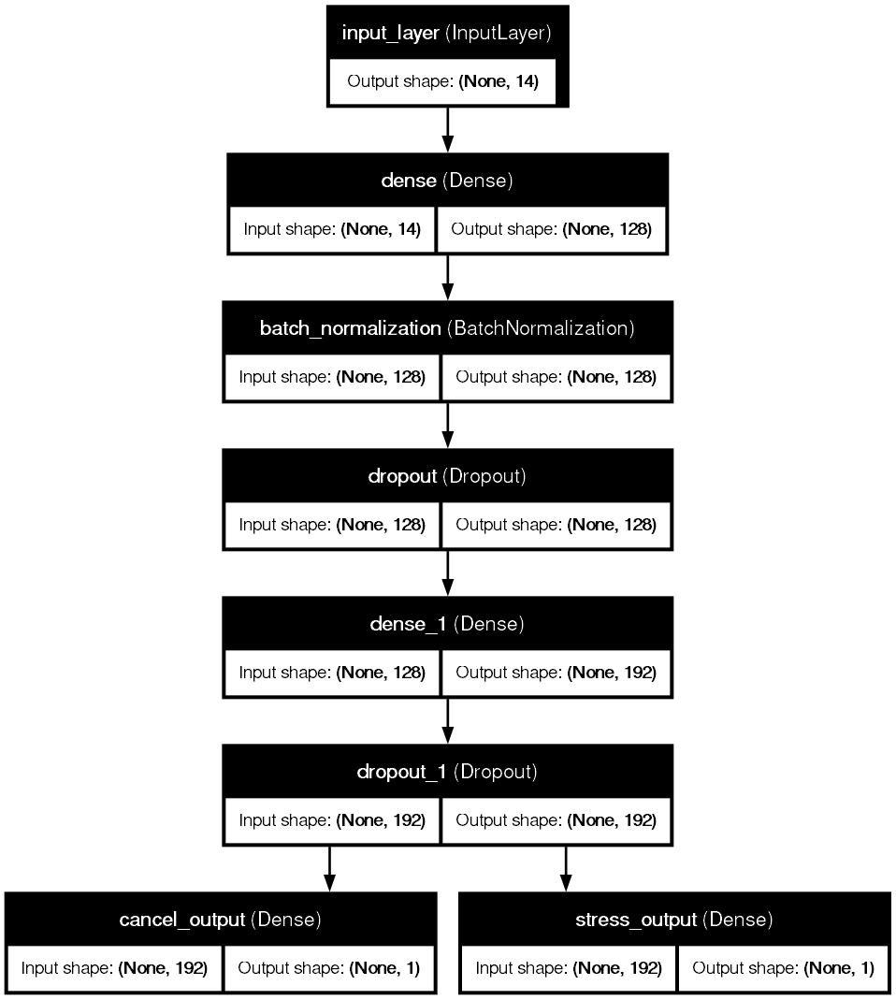

<div align="center">

# 🚕 Ride Supply Risk
### *AI-Powered Ride Cancellation & Supply Supply Demand Intelligence*


[](LICENSE)

**Ride Supply Risk** is a **Deep Learning-powered** system designed to predict **ride cancellations** and **supply-demand stress** in real-time.
It helps ride-sharing platforms optimize driver allocation and reduce revenue loss.

It answers the critical questions:

> **Will this ride be cancelled? Is there high supply stress in this area?**

</div>

---

# 🚀 What Problem Does It Solve?

Ride-sharing platforms face massive inefficiencies due to:

| Problem | Why it hurts |
| :--- | :--- |
| **Driver Cancellations** | Poor user experience & lost revenue |
| **Supply-Demand Mismatch** | Surge pricing inefficiencies & increased wait times |
| **Incomplete Rides** | Operational friction & safety concerns |
| **Blind Allocation** | Assigning high-risk rides to drivers likely to cancel |

**Ride Supply Risk** solves this by using a **Multi-Task Deep Learning Model** to simultaneously predict:
1.  **Cancellation Probability**: The likelihood of a driver or customer cancelling.
2.  **Supply Stress**: Whether the location is currently experiencing high demand relative to supply.

---

# 🧩 System Architecture



**Architecture Explained:**
*   **Input**: Vehicle type, location, booking value, distance, ratings, time.
*   **Engine**: A TensorFlow/Keras model with shared dense layers to learn common features, branching into two specific prediction heads.
*   **Output**: Real-time probabilities served via a high-performance FastAPI backend.

---

# 📁 Project Structure

```
Ride-Supply-Risk/
│
├── data/
│   ├── raw/                    # Original dataset
│   └── processed/              # Cleaned & Engineered features
│
├── models/
│   ├── multitask_ride_model.keras  # Trained TensorFlow Model
│   ├── feature_scaler.pkl          # Scikit-Learn Scaler
│   └── mappings.json               # Categorical Encodings (Vehicle, Location)
│
├── notebooks/
│   ├── 01_EDA.ipynb            # Exploratory Data Analysis & Feature Engineering
│   └── 02_Model_Training.ipynb # Model Architecture & Hyperparameter Tuning
│
├── src/
│   ├── api.py                  # FastAPI Application Entrypoint
│   ├── inference.py            # Inference Engine (Preprocessing + Prediction)
│   └── generate_mappings.py    # Utility to create mappings from raw data
│
├── README.md                   # Project Documentation
└── LICENSE                     # Apache 2.0 License
```

---

# 🧠 Machine Learning Layer

The core is a **Multi-Task Learning (MTL)** neural network built with **TensorFlow/Keras**.

### 🏗️ Model Architecture
*   **Input Layer**: 14 features (Cyclical time encodings, scaled numericals, embedded categoricals).
*   **Shared Layers**: 
    *   Dense (128 units, ReLU) + Batch Norm + Dropout (0.3)
    *   Dense (64 units, ReLU) + Dropout (0.2)
*   **Heads**:
    *   `cancel_output`: Sigmoid (Binary Classification)
    *   `stress_output`: Sigmoid (Binary Classification)

### ⚙️ Hyperparameters (Optimized via Keras Tuner)
*   **Optimizer**: Adam
*   **Loss Weights**: `Coverage: 1.0`, `Stress: 0.9`
*   **Optimum Shared Layers**: 2
*   **Batch Size**: 32

### 🏆 Performance Metrics
The model achieves high accuracy and AUC on the test set:

| Task | Metric | Value |
| :--- | :--- | :--- |
| **Cancellation** | **AUC** | **0.9314** |
| **Cancellation** | **Accuracy** | **85.94%** |
| **Supply Stress** | Accuracy | 91.32% |
| **Combined Loss** | Total Loss | 0.4823 |

> *Note: The high AUC indicates excellent discriminative ability between high-risk and low-risk rides.*

---

# 🌐 FastAPI — The Inference Engine

The backend is built with **FastAPI** for sub-millisecond latency.

| Endpoint | Method | Description |
| :--- | :--- | :--- |
| `/` | `GET` | Health Check & Model Status |
| `/predict` | `POST` | Get real-time predictions for a ride |
| `/swagger` | `GET` | Interactive API Documentation |

### Sample Request

```json
{
  "vehicle_type": "Auto",
  "pickup_location": "Rohini West",
  "drop_location": "Dwarka Mor",
  "booking_value": 450,
  "ride_distance": 12.5,
  "payment_method": "UPI",
  "driver_rating": 4.5
}
```

### Sample Response

```json
{
  "cancellation_probability": 0.9911,
  "supply_stress_probability": 0.0390
}
```

---

# 💻 Setup & Usage

### 1️⃣ Installation

Clone the repository and install dependencies:

```bash
git clone https://github.com/yourusername/Ride-Supply-Risk.git
cd Ride-Supply-Risk
pip install pandas numpy scikit-learn tensorflow fastapi uvicorn
```

### 2️⃣ Preparation

Ensure model artifacts are ready. If `models/mappings.json` is missing:

```bash
python src/generate_mappings.py
```

### 3️⃣ Run the API

Start the server using Uvicorn:

```bash
uvicorn src.api:app --reload
```

Access the **Swagger UI** at: [http://localhost:8000/swagger](http://localhost:8000/swagger)

---

## 📄 License

This project is licensed under the Apache 2.0 License - see the [LICENSE](LICENSE) file for details.

---

<div align="center">

**Made by Saish**

⭐ Star this repo if you find it useful!

</div>
